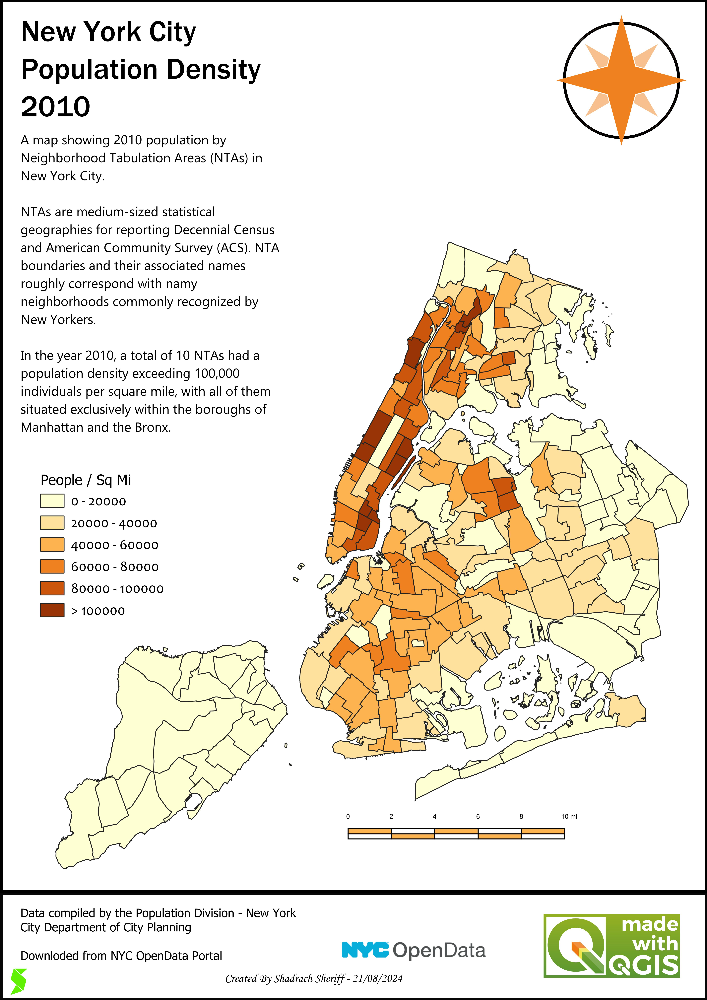
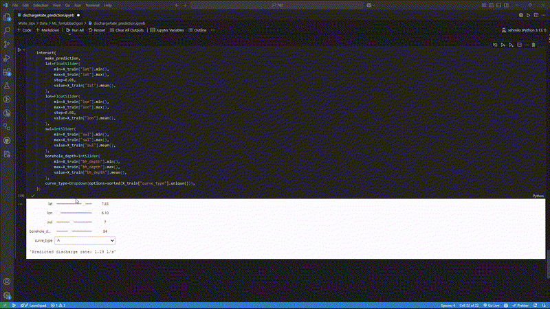
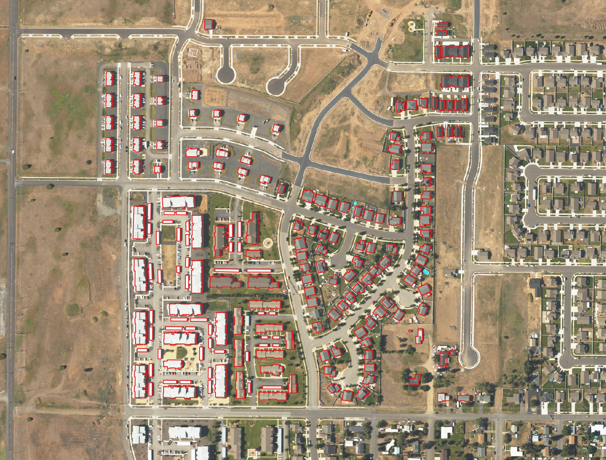
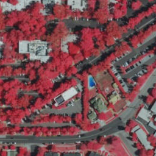

This is a summary of projects using python and ArcGIS for geospatial analyses.
Kindly click on the link to view more about the projects.
1. [Land Use Analysis Abuja](#land-use-analysis-abuja)
2. [Cartography](#Cartography)
3. [Discharge Rate Predictor](#Discharge-Rate-Predictor)
4. [GeoAI: Artificial Intelligence for Geospatial Data](#GeoAI-Artificial-Intelligence-for-Geospatial-Data)
5. [Deep Learning for SwimmingPool Detection](#Deep-Learning-for-SwimmingPool-Detection)
6. [Customer Segmentation in the-US](#Customer-Segmentation-in-the-US)

# [Land Use Analysis Abuja](https://github.com/sehmilo/Land-Use-Analysis_Abuja)
In this project, the data obtained displays a map of land use/land cover (LULC) derived from ESA Sentinel-2 imagery at 10m resolution. 
Each year is generated with Impact Observatory’s deep learning AI land classification model, trained using billions of human-labeled image pixels from the National Geographic Society. 
The maps are produced by applying this model to the Sentinel-2 Level-2A image collection on Microsoft’s Planetary Computer, processing over 400,000 Earth observations per year.

# [Cartography](https://github.com/sehmilo/Cartography)
From personal explorations to client projects, my journey in GIS mapping has been a terrain of growth. 
Each map—good, bad, and everything in between—tells a story of skill, refinement, and discovery. 
Here’s a collection of my cartographic evolution, showcasing how my maps have transformed over time. [Click the to view more](https://github.com/sehmilo/Cartography)

# [Discharge Rate Predictor](https://github.com/sehmilo/discharge_rate_predictor)
This a discharge rate predictor that uses static water level, lat-lon, and borehole depth to predict discharge rate (borehole yield) of a location in Northwestern Nigeria.

# [GeoAI: Artificial Intelligence for Geospatial Data](https://github.com/sehmilo/GeoAI_for_Geospatial_Data)
GeoAI bridges the gap between AI and geospatial analysis, providing tools for processing, analyzing, and visualizing geospatial data using advanced machine learning techniques. 
Whether you're working with satellite imagery, LiDAR point clouds, or vector data, GeoAI offers intuitive interfaces to apply cutting-edge AI models.

# [Deep Learning for SwimmingPool Detection](https://github.com/sehmilo/Deep_Learning_for_SwimmingPool_Detection)
Deep learning is a type of machine learning. It relies on multiple layers of nonlinear processing for feature identification and pattern recognition. 
ArcGIS uses deep learning frameworks to accomplish various deep learning analyses, including object detection. Object detection involves locating specific features within an image. 
Training a model to detect one object, or multiple objects, saves the time and expense of digitizing and collecting data. It also allows you to expand your analysis by using the model with different datasets and in different locations.

# [Customer Segmentation in the-US](https://github.com/sehmilo/Customer-Segmentation-in-the-US)
This project applies unsupervised learning (clustering) to the 2019 Survey of Consumer Finances data. 
It aids in marketing, customer segmentation, and social stratification studies. 
Key tasks include k-means clustering, feature selection, and PCA for dimensionality reduction. Insights are visualized using side-by-side bar charts.
